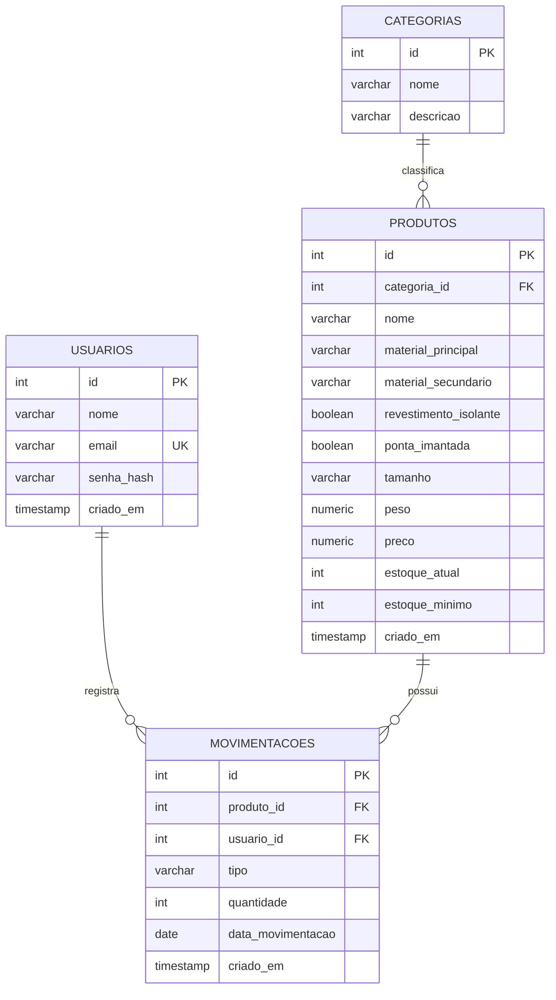

# Entrega 01 – Requisitos Funcionais
## Sistema de Gestão de Estoque para Almoxarifado de Ferramentas

| Código | Requisito Funcional |
|--------|----------------------|
| RF01 | O sistema deve permitir que o usuário efetue login informando e-mail e senha. |
| RF02 | O sistema deve exibir mensagem específica ao usuário quando a autenticação falhar (usuário inexistente, senha incorreta, campos vazios), redirecionando-o novamente à tela de login. |
| RF03 | O sistema deve permitir que o usuário efetue logout, retornando à tela de login. |
| RF04 | O sistema deve exibir o nome do usuário autenticado na interface principal. |
| RF05 | O sistema deve permitir a navegação, a partir da interface principal, para a tela de "Cadastro de Produto" e para a tela de "Gestão de Estoque". |
| RF06 | O sistema deve permitir o cadastro de um novo produto, contendo nome, categoria, material principal, material secundário, revestimento isolante (sim/não), ponta imantada (sim/não), tamanho, peso, preço, estoque atual e estoque mínimo. |
| RF07 | O sistema deve listar automaticamente, em formato de tabela, todos os produtos cadastrados ao acessar a tela de cadastro de produto. |
| RF08 | O sistema deve permitir a busca de produtos por termo, atualizando a listagem com os resultados correspondentes. |
| RF09 | O sistema deve permitir a edição dos dados de um produto já cadastrado. |
| RF10 | O sistema deve permitir a exclusão de um produto cadastrado. |
| RF11 | O sistema deve validar os campos obrigatórios do formulário de produto, exibindo alertas ao usuário em caso de dados ausentes ou inválidos. |
| RF12 | O sistema deve permitir o retorno à interface principal a partir da tela de cadastro de produto. |
| RF13 | O sistema deve listar, na tela de gestão de estoque, todos os produtos cadastrados em ordem alfabética, aplicando um algoritmo de ordenação sobre os dados. |
| RF14 | O sistema deve permitir a seleção de um produto e o registro de uma movimentação de estoque do tipo "entrada" ou "saída". |
| RF15 | O sistema deve permitir a inserção da data em que a movimentação de estoque ocorreu. |
| RF16 | O sistema deve verificar automaticamente, a cada movimentação de saída, se o estoque resultante do produto ficou abaixo do estoque mínimo configurado, exibindo um alerta ao usuário nesse caso. |
| RF17 | O sistema deve registrar, para cada movimentação, o produto, o tipo (entrada/saída), a quantidade, a data informada, o usuário responsável e o momento do registro, mantendo um histórico completo e rastreável. |
| RF18 | O sistema deve impedir a movimentação de saída quando a quantidade solicitada for maior do que o estoque atual disponível. |

